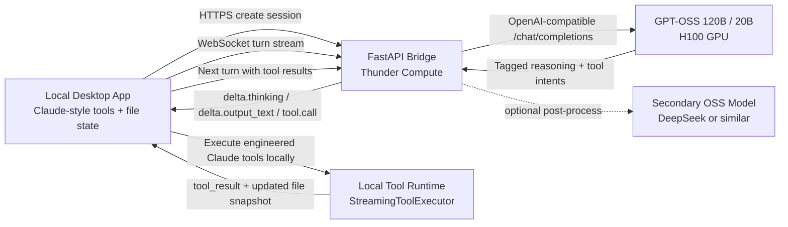

# Remote GPT-OSS Bridge

This bridge now supports two integration shapes:

- The custom bridge protocol for a standalone local client.
- An Anthropic-compatible `/v1/messages` proxy so the leaked Claude CLI can keep running the real local tool loop while the remote Thunder Compute server handles GPT-OSS inference.

## Topology



## Anthropic-Compatible Mode

The desktop launcher now has a `Remote GPT-OSS server` backend option. In that mode it:

1. Keeps the local Claude CLI and engineered tools running on the desktop.
2. Points `ANTHROPIC_BASE_URL` at this FastAPI service.
3. Uses `CLAUDE_CODE_COMPAT_MODE=generic` so the CLI sends Anthropic-style `messages` requests to the proxy.
4. Lets the proxy translate those requests into GPT-OSS turns and map the result back into Anthropic `thinking`, `text`, and `tool_use` blocks.

The required server endpoints for that path are:

- `GET /healthz`
- `GET /v1/models`
- `POST /v1/messages`
- `POST /v1/messages/count_tokens`

`/healthz` now performs an upstream readiness probe. The desktop launcher will refuse to start the remote session if the bridge itself is reachable but the configured GPT-OSS lanes are not actually serving yet.

`GET /v1/models` is a lightweight compatibility smoke test that the desktop launcher uses after the bridge is up. It proxies the configured upstream model list so the launcher can verify the bridge can still reach vLLM before it forwards the port.

## Bridge Protocol

Internally, the remote model is asked to speak a narrow bridge protocol:

- `<thinking>...</thinking>` for hidden reasoning blocks
- `<final>...</final>` for user-visible text
- `<tool_call name="Read" id="call_123">{...json...}</tool_call>` for local tool execution

The server parses those tags and emits normalized WebSocket events:

- `delta.thinking`
- `delta.output_text`
- `tool.call`
- `turn.completed`

On the desktop side, [remoteGlmResponseAdapter.ts](/C:/Users/ethan/OneDrive/Documents/GitHub/claude-code-src-leaked/desktop-app/remoteGlmResponseAdapter.ts) converts those events into the same block shapes the existing app already understands when you use the standalone bridge client:

- `thinking`
- `text`
- `tool_use`

That means the existing message renderer, memory compaction, and tool executor stay untouched.

## Deployment

1. Start one or two OpenAI-compatible GPT-OSS endpoints on the Thunder instance.
2. Install the bridge dependencies:

```bash
pip install -r server/remote_glm_bridge/requirements.txt
```

3. Export the bridge configuration:

```bash
export GPT_OSS_BRIDGE_API_KEYS="replace-me"
export GPT_OSS_BASE_URL="http://127.0.0.1:8000/v1"
export GPT_OSS_API_KEY=""
export GPT_OSS_PRIMARY_MODEL="gpt-oss-120b"
export GPT_OSS_FAST_MODEL="gpt-oss-20b"
export GPT_OSS_AUTO_MODEL_ALIAS="gpt-oss-auto"
python -m server.remote_glm_bridge.main
```

You can also build a container image directly:

```bash
docker build -f server/remote_glm_bridge/Dockerfile -t claude-body-gpt-oss-bridge .
docker run --rm -p 8787:8787 --env-file server/remote_glm_bridge/.env.example claude-body-gpt-oss-bridge
```

4. In the desktop launcher, choose `Remote GPT-OSS server (120B/20B)` and fill in:

- Bridge base URL: `https://your-host:8787`
- Bridge API key: the value from `GPT_OSS_BRIDGE_API_KEYS`
- Remote model alias: usually `gpt-oss-auto`

5. If you still want the standalone custom bridge flow, use [remoteGlmBridgeClient.ts](/C:/Users/ethan/OneDrive/Documents/GitHub/claude-code-src-leaked/desktop-app/remoteGlmBridgeClient.ts) to create a session and stream turns.

## Routing

The bridge supports three model names on the Anthropic-compatible side:

- `gpt-oss-120b`: always use the stronger primary model
- `gpt-oss-20b`: always use the faster lightweight model
- `gpt-oss-auto`: route between them automatically

The default `gpt-oss-auto` lane uses the fast model for lighter turns and escalates to the 120B model for larger context, prior tool-result-heavy turns, and prompts that look architecturally or diagnostically complex.

## Local Integration Shape

The intended local flow is:

1. Build a compact workspace snapshot from the current repo, memory, and only the files relevant to the turn.
2. Send that snapshot plus the tool manifest to the remote server.
3. Accumulate `delta.thinking`, `delta.output_text`, and `tool.call` events with the response adapter.
4. Feed the resulting assistant message into the existing local tool loop.
5. Send tool results and updated workspace patches back on the next turn.

This keeps long-horizon planning remote while preserving local file authority and tool safety.
